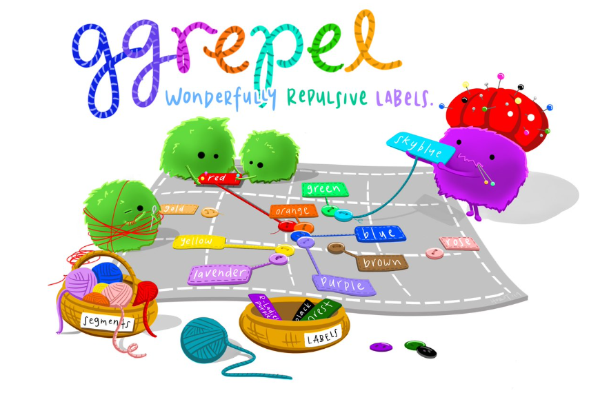

## 2 Beyond ggplot2 Fundamentals

Introducing ggplot extensions for creating more elegant and effective statistical graphics.

-   control the placement of annotation on a graph by using functions provided in ggrepel package,

-   create professional publication quality figure by using functions provided in ggthemes and hrbrthemes packages,

-   plot composite figure by combining ggplot2 graphs by using patchwork package.

## 2.2 Getting started

### Installing and loading the required libraries

-   ggrepel: an R package provides geoms for ggplot2 to repel overlapping text labels.

-   ggthemes: an R package provides some extra themes, geoms, and scales for ‘ggplot2’.

-   hrbrthemes: an R package provides typography-centric themes and theme components for ggplot2.

-   patchwork: an R package for preparing composite figure created using ggplot2.

    Code chunk below will be used to check if these packages have been installed and also will load them onto your working R environment.

```{r}
pacman::p_load(ggrepel, patchwork, 
               ggthemes, hrbrthemes,
               tidyverse) 
```

### 2.2.2 Importing data

```{r}
library(readr) # Load the readr library
exam_data <- read_csv("data/Exam_data.csv")
```

There are a total of seven attributes in the exam_data tibble data frame. Four of them are categorical data type and the other three are in continuous data type.

-   The categorical attributes are: ID, CLASS, GENDER and RACE.

-   The continuous attributes are: MATHS, ENGLISH and SCIENCE.

## 2.3 Beyond ggplot2 Annotation: ggrepel

One of the challenge in plotting statistical graph is annotation, especially with large number of data points.

```{r}
ggplot(data=exam_data, 
       aes(x= MATHS, 
           y=ENGLISH)) +
  geom_point() +
  geom_smooth(method=lm, 
              linewidth=0.5) +  
  geom_label(aes(label = ID), 
             hjust = .5, 
             vjust = -.5) +
  coord_cartesian(xlim=c(0,100),
                  ylim=c(0,100)) +
  ggtitle("English scores versus Maths scores for Primary 3")
```

[ggrepel](https://ggrepel.slowkow.com/) is an extension of **ggplot2** package which provides `geoms` for **ggplot2** to repel overlapping text as in our examples on the right.

{width="492"}

We simple replace  `geom_text()` by [`geom_text_repel()`](https://ggrepel.slowkow.com/reference/geom_text_repel.html) and `geom_label()` by [`geom_label_repel`](https://ggrepel.slowkow.com/reference/geom_text_repel.html).

### 2.3.1 Working with ggrepel


